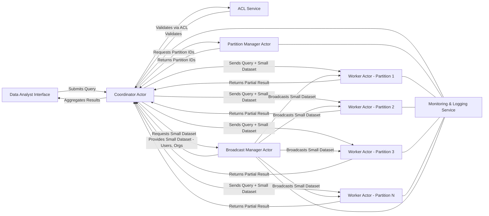

# F O R C E: Fault-tolerant Optimized Reliable Computational Engine

# GitHub Events Distributed Processing System

This system is designed to efficiently process large datasets of GitHub Events API Payloads (GH
Archive) by utilizing a distributed actor-based architecture. Built in Scala with Akka, the system
partitions and replicates the dataset across worker actors, processes it locally, and provides
various query-based functionalities for data analysts.

## Features

1. **Partitioning & Replication**:
    - The system efficiently partitions the dataset and replicates each partition across worker
      actors for fault-tolerant processing.

2. **Querying**:
    - Supports multiple query types, including filters on date range, event type, actor, repository,
      and more.
    - Results are aggregated and refined based on additional criteria.
    - Detailed drill-down analysis is available to inspect individual event records.

3. **Automated Monitoring**:
    - Data analysts can schedule recurring queries for monitoring event trends.
    - Queries are automatically executed and the results are updated on a centralized dashboard.

4. **Comparative Analysis**:
    - Facilitates comparison of event trends across different repositories, aggregating and
      visualizing the data for easy analysis.

## Acceptance Criteria (To be reached)

- **Average Processing Time**:
    - Time < 50 ms per actor.
    - 90th percentile < 100 ms per actor.

- **Message Throughput**:
    - Each actor can process ≥ 500 messages/second.

- **Mailbox Size**:
    - Average mailbox size < 20 messages per actor for 95% of the time.

## System Requirements

- **Scala SDK**: 2.12.17
- **Akka**: Version 2.6.10
- **JDK**: 17.0.14 Coretto

## Architecture Overview

- **Client:**  
  Submits queries to the system and receives results.

- **Coordinator Actor:**  
  Manages query routing, aggregates results, and ensures efficient communication.

- **Worker Actors:**  
  Process data locally based on the assigned partitions and return partial results.

- **Replication Manager:**  
  Maintains replicas of data partitions for fault tolerance and handles failover in case of node
  failure.

- **Broadcast Service:**  
  Efficiently distributes small, immutable datasets to all nodes to minimize data redundancy.

### System Flow

1. The **Client** sends a query to the **Coordinator Actor**.
2. The **Coordinator** identifies which **Worker Actors** store the relevant data partitions.
3. Queries are sent to the appropriate **Worker Actors** for local execution.
4. **Worker Actors** return partial results to the **Coordinator**.
5. The **Coordinator** aggregates these results and sends the final output to the **Client**.

### Fault Tolerance

- **Replication Manager** ensures that each data partition has replicas stored across multiple
  nodes.
- In case of a node failure, queries are redirected to the replica nodes.

### Diagram

The below diagram illustrates the high-level architecture

### Details

- **User:** Initiates the query request.
- **Coordinator Actor:**
    - Validates user access via the ACL Service.
    - Requests partition information from the Partition Manager.
    - Requests the small dataset (users, orgs) from the Broadcast Manager.
    - Distributes the query and small dataset to all relevant Worker Actors.
    - Aggregates partial results received from Worker Actors and sends the final result back to the
      Data Analyst.
- **Partition Manager Actor:** Returns the list of partition IDs based on the query. Partition all the github events into different parts based on their event type.
- **Broadcast Manager Actor:**
    - Holds or retrieves the small datasets (users, orgs).
    - Broadcasts the small dataset to Worker Actors and responds to requests from the Coordinator.
    - Use API to get the newiest information of user or organization, and enrich/update the big dataset once they changed their information
- **Worker Actors:**
    - Receive the query along with the small dataset.
    - Process the local partition of GitHub event data.
    - Join the event data with the small dataset as needed.
    - Return the partial results to the Coordinator.
- **ACL Service:** Provides role-based access control validation.
- **Monitoring & Logging Service:** Collects metrics from all system components (e.g., mailbox
  sizes, processing times, restarts).

## Query Examples

   
## Metrics 

View Kamon Telemetry on http://localhost:5266/#/
View Prometheus Metrics on http://localhost:9095/metrics
